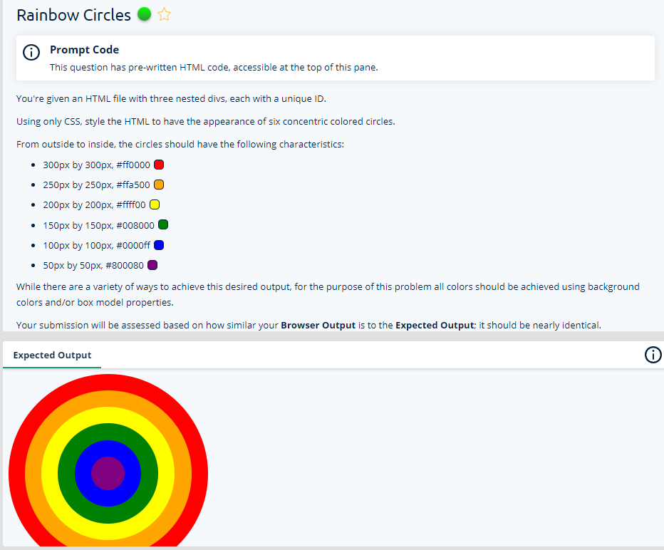
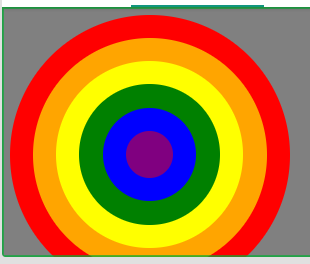

# Web Dev Practice
Question1 :
CSS content alignment and border properties

Answer:

/*  Write your code here. */

/* Delete this ruleset. */
body {
  background-color: grey;
}
div{
  border-radius: 50%;
  display: flex;
  align-items: center;
  justify-content: center;
}
#outer {
  background-color: #ffa500;
  height: 250px;
  width: 250px;
  border: 25px solid #ff0000;
}
#middle {
  background-color: #008000;
  height: 150px;
  width: 150px;
  border: 25px solid #ffff00;
}
#inner {
  background-color: #800080;
  height: 50px;
  width: 50px;
  border: 25px solid #0000ff;
}

