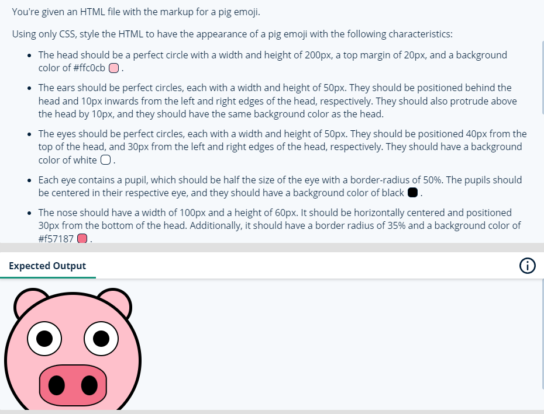
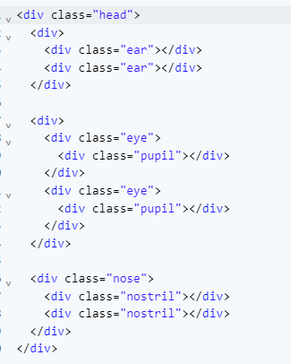
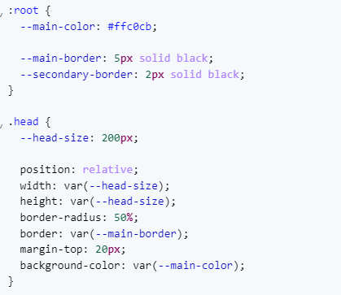

# Web Dev Practice
Question 3:

Note only(in case i want to use css variables):

Answer:
.head{
  position: relative; /* we set it as relative so that all other elements within the head can be set to absolute and can be position relative to this main div */
  height: 200px;
  width: 200px;
  border-radius: 50%; /* let's consider a square element with equal width and height. When you set the border-radius to 50%, it means that the radius of each corner is half of the side length of the square. Since all four corners have the same radius, and the sides of the square are equal, the resulting shape will be a perfect circle inscribed within the square.*/
  border: 5px solid black;
  margin-top: 20px; /* leave 20px space at the top with respect to the nearest element above it */
  background-color: #ffc0cb;
}
.ear{
  position: absolute; /* positions element absolute to head. position absolute-relative pairs are a good way to determine the position of an element. it helps us use top left right z-index and similar positioning attributes */
  z-index: -1; /* sends it behind all other elements */
  width: 50px;
  height: 50px;
  top: -10px; /* pushes ears 10px from the top, even above the div */
  border-radius: 50%;
  border: 5px solid black;
  background-color: #ffc0cb;
}
.ear:first-child{
  left: 10px; /*pushes first ear 10px from the left */
}
.ear:nth-child(2){
  right: 10px; /*pushes second ear 10px from the right */
}
.eye{
  position: absolute;
  display: flex;
  justify-content: center;
  align-items: center;
  top: 40px;
  height: 50px;
  width: 50px;
  border: 2px solid black;
  border-radius: 50%;
  background-color: white;
}
.eye:first-child {
  left: 30px;
}
.eye:nth-child(2) {
  right: 30px;
}

.pupil{
    height: 50%;
    width: 50%;
    border-radius: 50%;
    background-color: black;
}
.nose{
  position: absolute;
  display: flex;
  justify-content: space-around; /* gives less space outside and more space between elements when compared to space evenly */
  align-items: center;
  width: 100px;
  height: 60px;
  bottom: 30px;
  left: 50%; /* we use this instead of the alternative css command:- margin: 0 auto ads all the extra space is pushed into right value by default with position absolute */
  transform: translateX(-50%); /*considers the left: 50% only from middle and sort of pushes it back halfway */
  border: 2px solid black;
  border-radius: 35%;
  background-color: #f57187;
}

.nostril {
    width: 25%;
    height: 50%;
    border-radius: 50%;
    background-color: black;
}