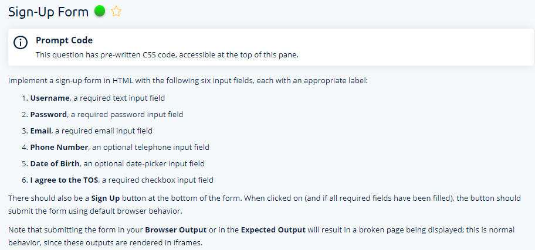
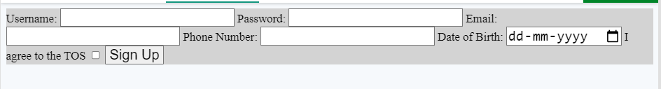

# Web Dev Practice
Question1

Answer:
<!-- Write your code here. -->

  <form>
  <label for="uname">Username: </label>
  <input type="text" id="uname" name="uname" required>
  <label for="pward">Password: </label>
  <input type="Password" id="pward" name="pward" required>
  <label for="email">Email: </label>
  <input type="email" id="email" name="email" required>
  <label for="pnumber">Phone Number: </label>
  <input type="tel" id="pnumber" name="pnumber">
  <label for="dob">Date of Birth: </label>
  <input type="date" id="dob" name="dob">
    <label for="cbox">I agree to the TOS </label>
  <input type="checkbox" id="cbox" name="cbox" required>
  <button type="submit">Sign Up</button>
    </form>

<!-- Delete this line. -->

