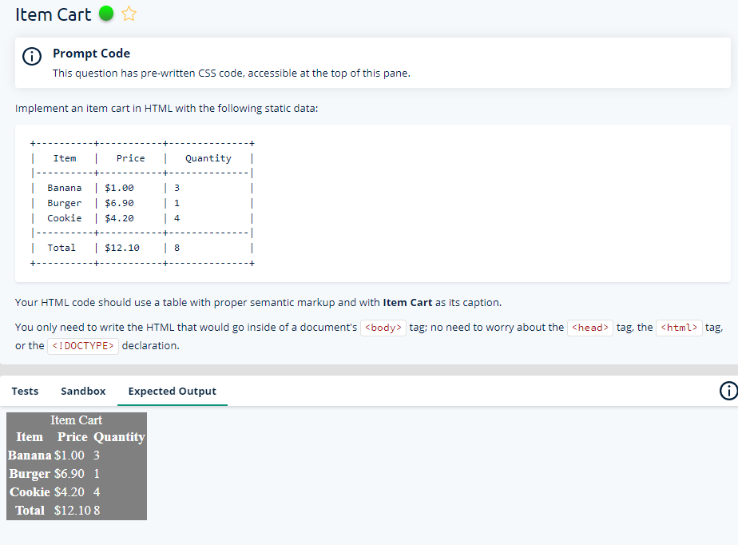
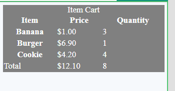

# Web Dev Practice

Question2:

Answer:
<!-- Write your code here. -->
<table style="width:100%">
  
<caption>Item Cart</caption>
    <thead style="text-align:center">
  <tr>
    <th>Item</th>
    <th>Price</th>
    <th>Quantity</th>
  </tr>
      </thead>
  <tbody>
  <tr>
    <th scope="rowheader">Banana</td>
    <td>$1.00</td>
    <td>3</td>
  </tr>
  <tr>
    <th scope="rowheader">Burger</td>
    <td>$6.90</td>
    <td>1</td>
  </tr>
  <tr>
    <th scope="rowheader">Cookie</td>
    <td>$4.20</td>
    <td>4</td>
  </tr>
    </tbody>
  <tfoot>
  <tr>
    <td>Total</td>
    <td>$12.10</td>
    <td>8</td>
  </tr>
    </tfoot>
</table>

