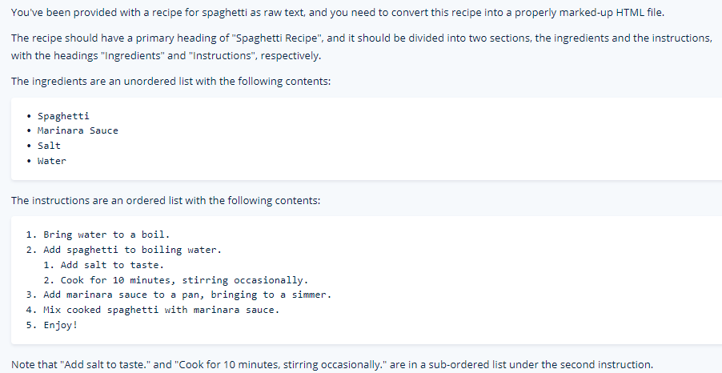
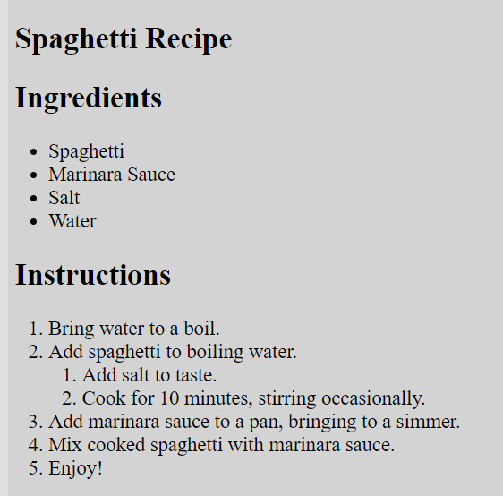

# Web Dev Practice

Question:

Answer:

<article>
  <header>
    <h1>Spaghetti Recipe</h1>
  </header>

<section>
  <h2>Ingredients</h2>
  <ul>
    <li>Spaghetti</li>
    <li>Marinara Sauce</li>
    <li>Salt</li>
    <li>Water</li>
  </ul>
  </section>
  
<section>
<h2>Instructions</h2>
  <ol>
    <li>Bring water to a boil.</li>
    <li>
      Add spaghetti to boiling water.
    <ol>
      <li>Add salt to taste.</li>
      <li>Cook for 10 minutes, stirring occasionally.</li>
    </ol>
    </li>
  <li>Add marinara sauce to a pan, bringing to a simmer.</li>
  <li>Mix cooked spaghetti with marinara sauce.</li>
  <li>Enjoy!</li></ol>
</section>
</article>

